# uv-mask-tool ✨


**uv-mask-tool** is an interactive, one-page web app built with Streamlit, OpenCV, and Python. It transforms your UV, reference, and mask images into precisely tuned mask images for UV exposure—ideal for resin 3D printing.

---

## Table of Contents
- [Overview](#overview)
- [Features](#features)
- [Quickstart](#quickstart)
- [Pipeline Overview](#pipeline-overview)
- [Contributing](#contributing)
- [License](#license)
- [Contact](#contact)

---

## Overview
**uv-mask-tool** streamlines the generation of customized mask images, giving you full control over every processing parameter—from exposure adjustment to advanced smoothing—so you can achieve impeccable UV masks for high-quality resin prints.

---

## Features
- **Drag-and-Drop Upload:** Effortlessly import your reference, mask, and UV images.
- **Customizable Parameters:** Fine-tune exposure, smoothing, cropping, and more.
- **Step-by-Step Visualization:** Expandable panels let you inspect each processing stage.
- **Downloadable Outputs:** Save both cropped and full-size mask images, ready for UV display.
- **Responsive & Modern:** Designed for an intuitive, playful experience on any device.

---

## Quickstart
1. **Clone the Repo:**
   ```bash
   git clone https://github.com/yourusername/uv-mask-tool.git
   cd uv-mask-tool
   ```
2. **Install Dependencies:**
   ```bash
   pip install -r requirements.txt
   ```
3. **Run the App:**
   ```bash
   streamlit run app.py
   ```
4. **Get Masked:**  
   Drag & drop your images, tweak the parameters, and generate your custom UV masks!

---

## Pipeline Overview

```mermaid
flowchart TD
    A(["🔥 DROP FILES: Reference, Mask, & UV Images"])
    B(["⚡ PREPROCESS: Convert to Grayscale & Normalize"])
    C(["🎯 MASK EXTRACTION: Pinpoint ROI & Crop Like a Boss"])
    D(["💥 DIFFERENCE STRIKE: Compute UV Image Discrepancies"])
    E(["🔥 SMOOTHING OVERDRIVE: Merge & Refine with Laser Precision"])
    F(["🚀 FINAL MASK: Unleash Ultimate UV Exposure"])

    A --> B
    B --> C
    C --> D
    D --> E
    E --> F
```



## Contributing
Contributions are welcome! Please see [CONTRIBUTING.md](./CONTRIBUTING.md) for details on how to get started.

---

## License
[](./LICENSE)

---

## Contact
Questions, ideas, or just want to say hi? Reach out on [Telegram @forthetim6being](https://t.me/forthetim6being).

---

Happy mask making and high-quality resin printing—keep it lit and print on! ✨